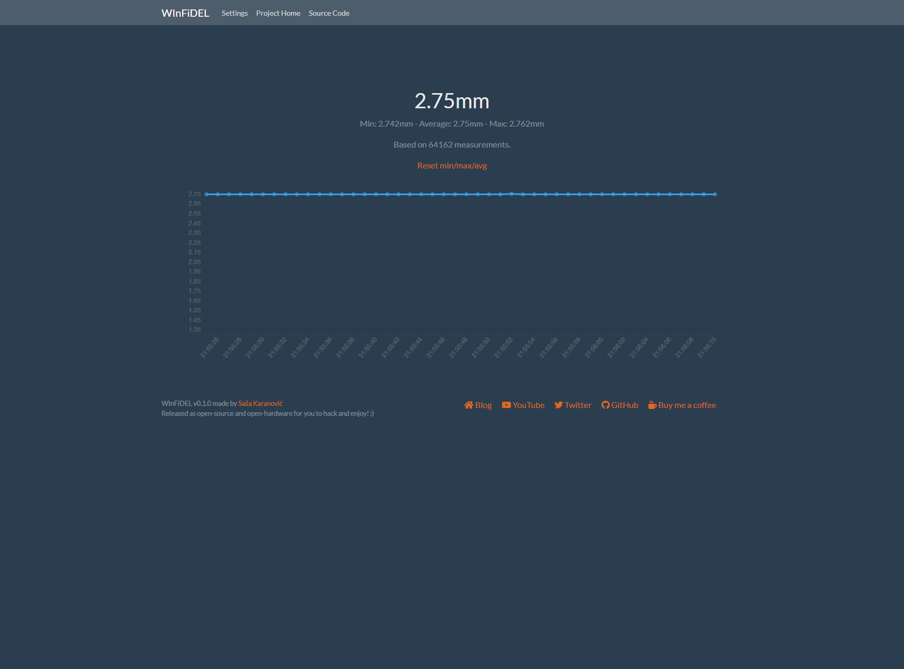
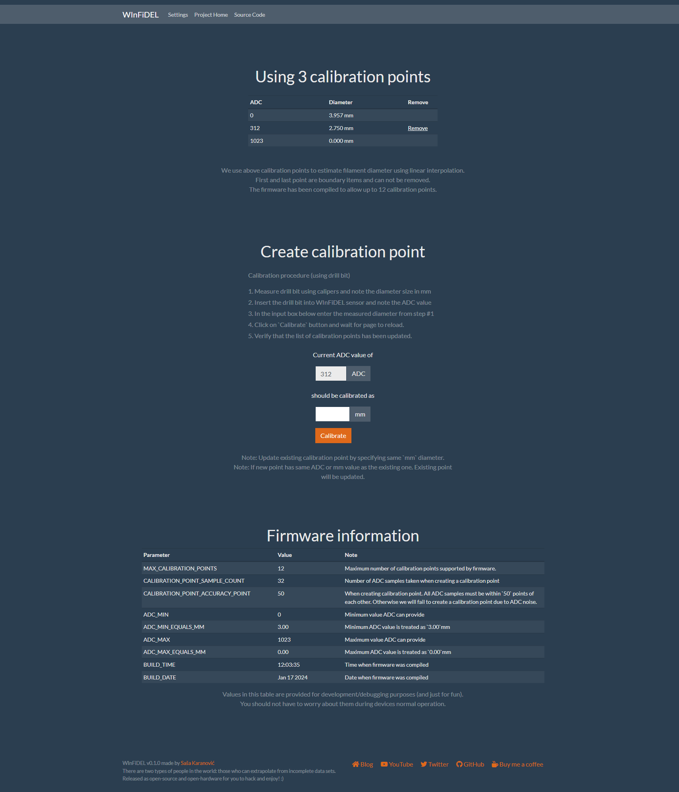

# WInFiDEL Sensor

**W**ireless
**In**line
**Fi**lament
**D**iameter
**E**stimator
**L**ow-cost
Sensor

## What is WInFiDEL?

[WInFiDEL Video](https://www.youtube.com/watch?v=FzXX6JxIw_Q)

WInFiDEL is an DIY open-source open-hardware Wireless 3D printing filament diameter sensor.

This design is heavily inspired by the design previously published by Made with Layers (Thomas Sanladerer) (video: https://www.youtube.com/watch?v=RYgdLPe_T0c)

## Can I build my own WInFiDEL sensor?

Yes! All the source files (hardware and firmware) are available in this repository.

## Can I purchase WInFiDEL PCBA?

Yes! It's available on the [web shop](https://shop.sasakaranovic.com/products/winfidel).

## Where can I find documentation?

WInFiDEL documentation can be found on the [official documentation page](https://docs.sasakaranovic.com/winfidel/).

## Screenshots

## Sasa Karanovic

<a href="https://sasakaranovic.com/" target="_blank" title="Sasa Karanovic Home Page"> Home Page</a> &nbsp;&middot;&nbsp;
<a href="https://youtube.com/c/sasakaranovic" target="_blank" title="Sasa Karanovic on YouTube"> YouTube</a> &nbsp;&middot;&nbsp;
<a href="https://github.com/sasakaranovic" target="_blank" title="Sasa Karanovic on GitHub"> GitHub</a> &nbsp;&middot;&nbsp;
<a href="https://twitter.com/_sasakaranovic_" target="_blank" title="Sasa Karanovic on Twitter"> Twitter</a> &nbsp;&middot;&nbsp;
<a href="https://instagram.com/_sasakaranovic_" target="_blank" title="Sasa Karanovic on Instagram"> Instagram</a> &nbsp;&middot;&nbsp;
<a href="https://github.com/sponsors/SasaKaranovic" target="_blank" title="Sponsor on GitHub"> Sponsor on GitHub</a>
